## Projeto Awax pronto
Layout pego no site [behance](https://www.behance.net/)
 
Objetivo desse projeto é de praticar meus conhecimentos em html/css.
 

#### Images do Layout behance

### Layout DESKTOP
> LAYOUT_DESKTOP.jpg
 

### Layout MOBILE
> LAYOUT_MOBILE.jpg

#### Tecnologias
> HTML
> 
> CSS
>
> JAVASCRIPT
 

#### Image da responsividade do projeto
Layout totalmente responsivo, se comportando bem em celulares, tablet e desktop.
 

  <h3>Layout Mobile</h3>
  <small>Algumas imagens</small>
    
  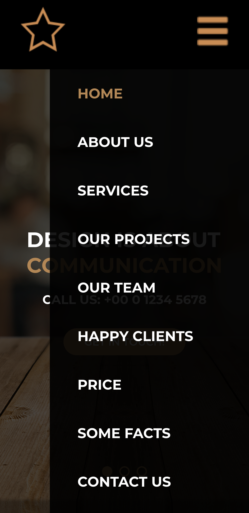
    
  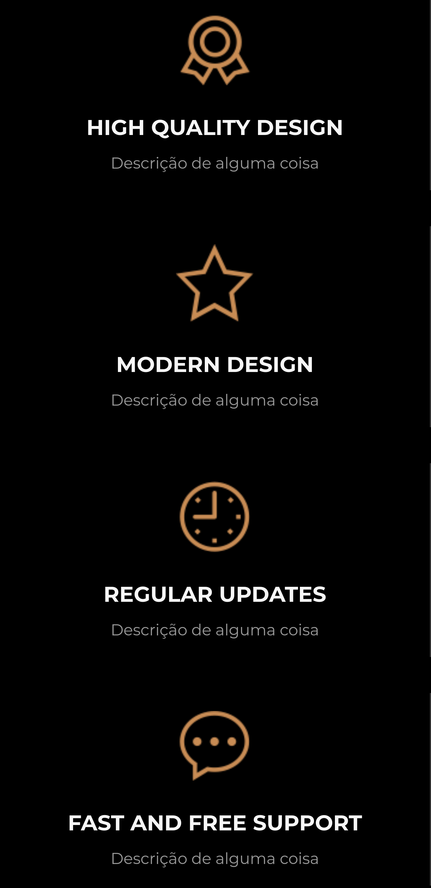
    
  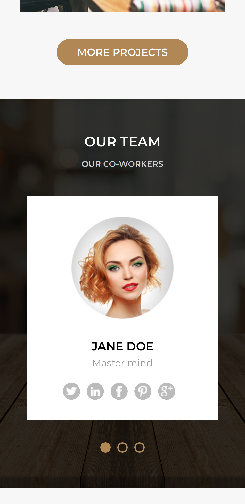
    
  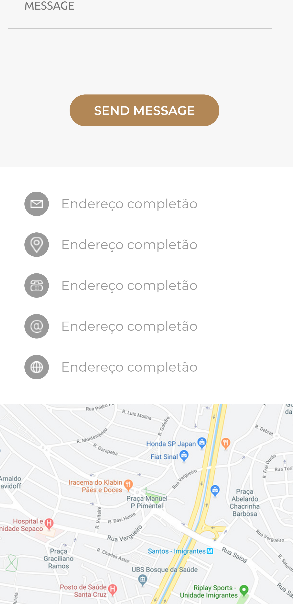
    
  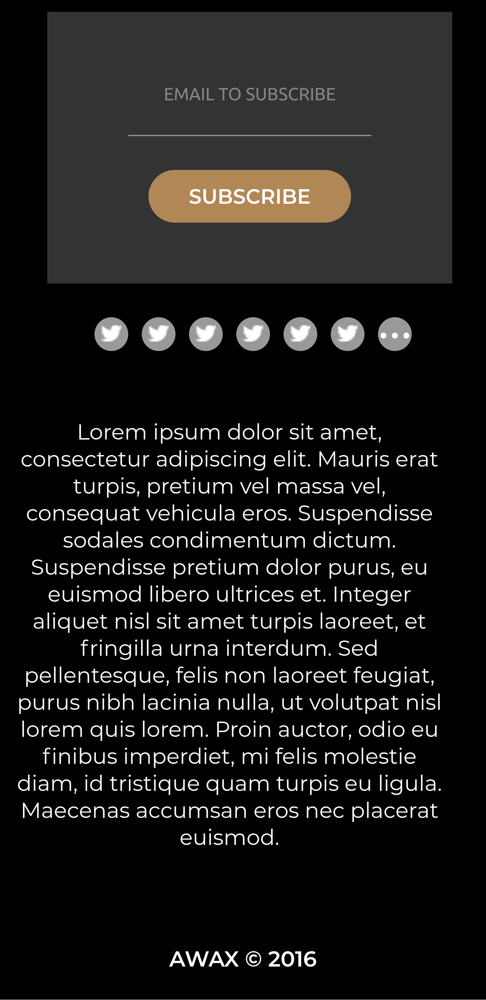

   

  <h3>Layout Tablet</h3>
  <small>Algumas imagens</small>
    
  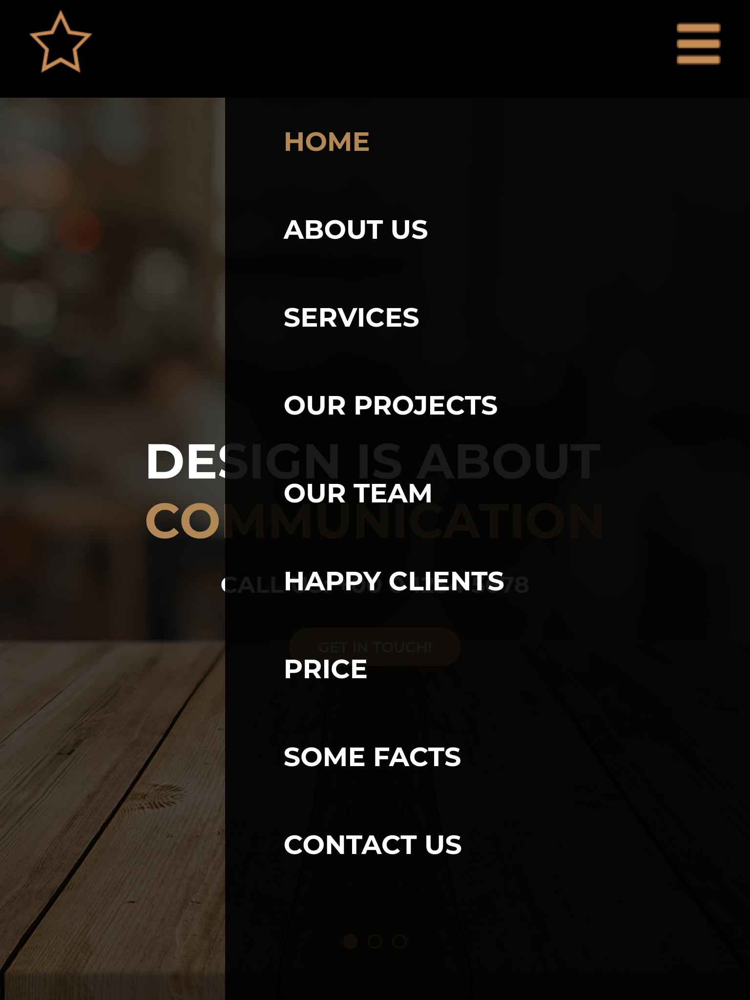
  
  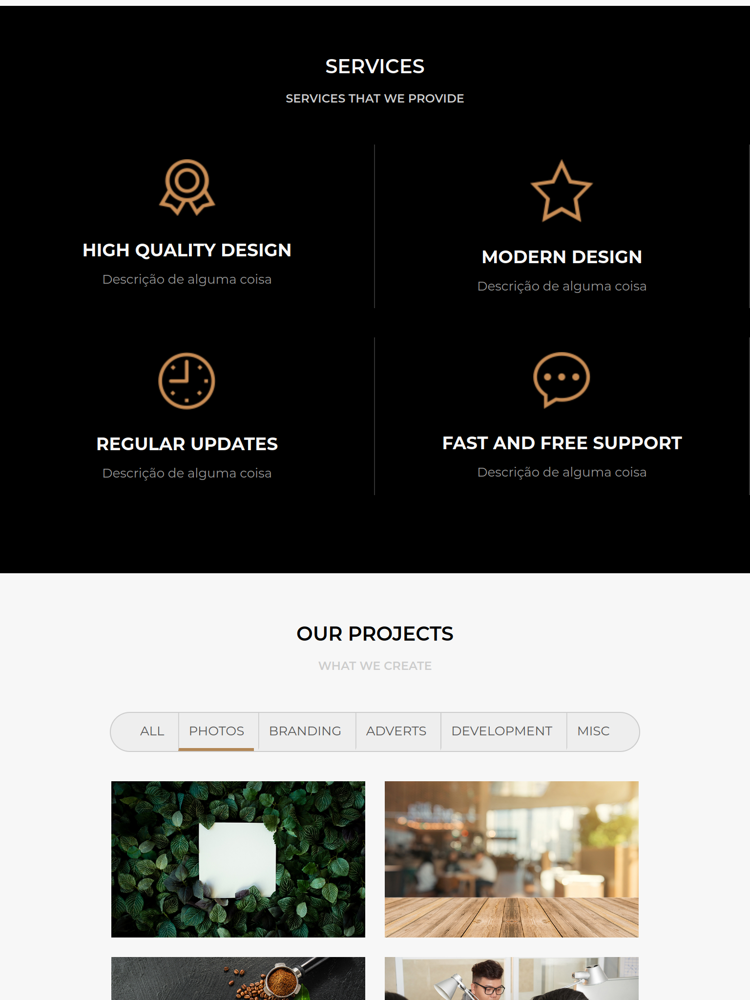
  
  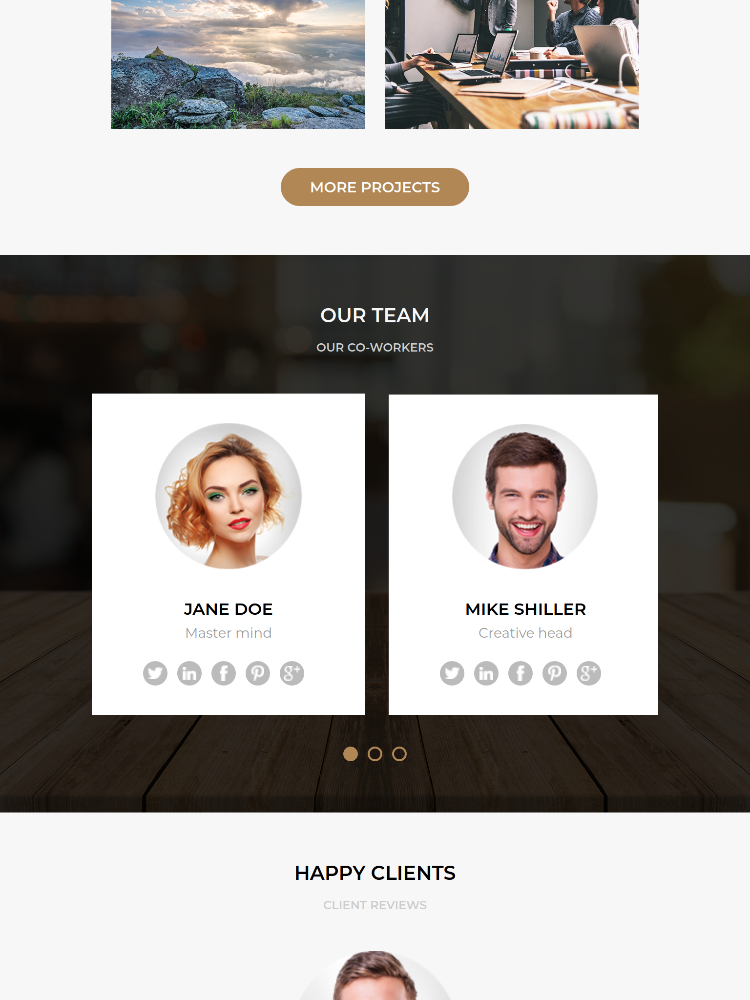
  
  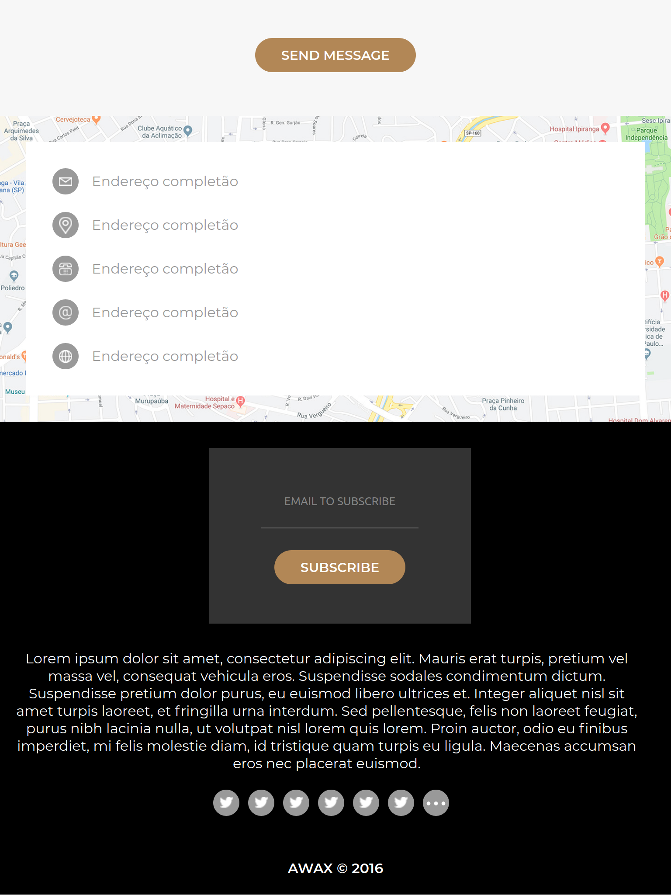

   

  <h3>Layout Desktop</h3>
  <small>Algumas imagens</small>
    
  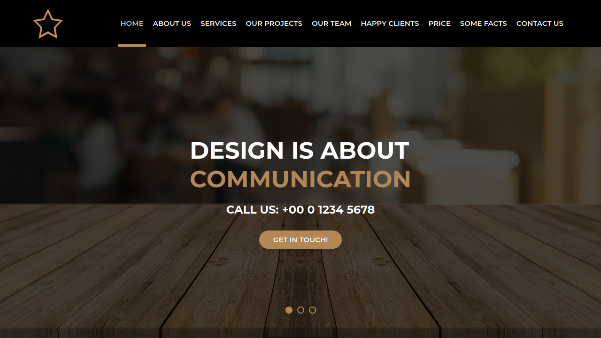
    
  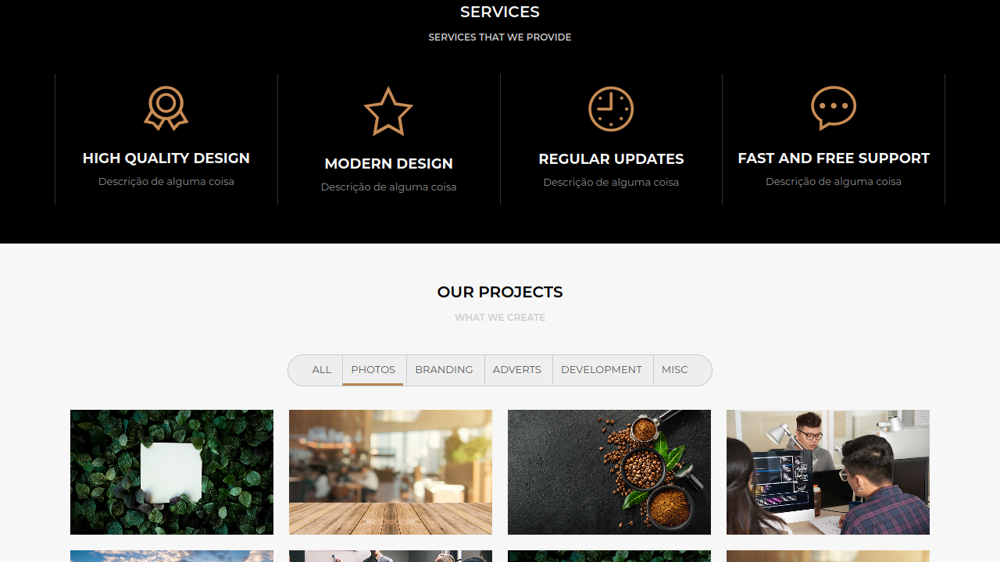
    
  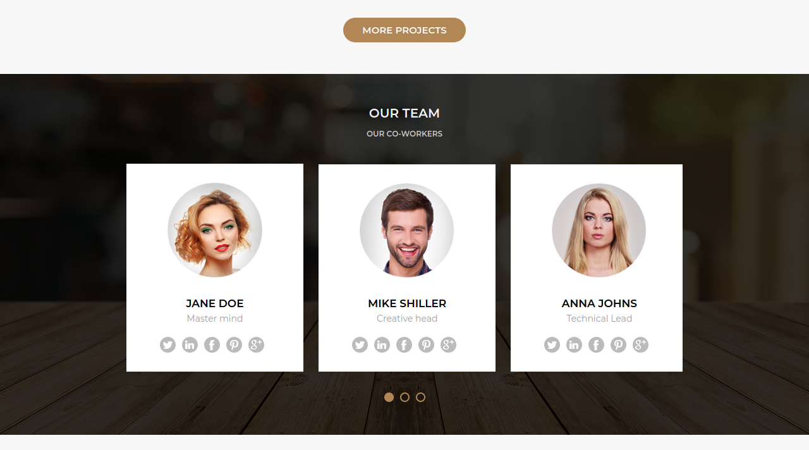
    
  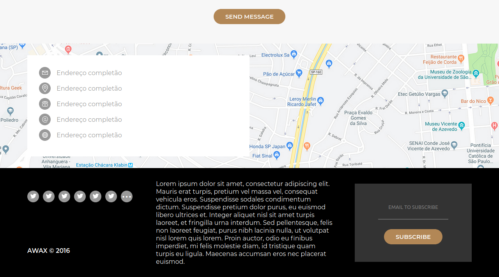

  

 
  Codigo feito por

 
  Vando dos Reis

